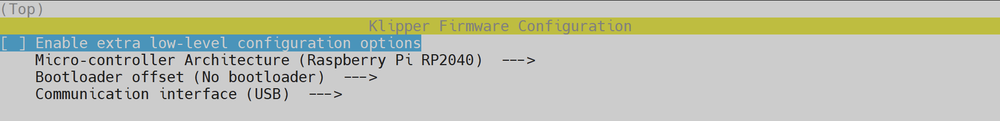

---
hide:
  - toc
---

# Configuration de l'ADXL

Klipper intégre le support de l'accéléromètre ADXL345, qui peut être utilisé pour mesurer les fréquences de résonance de l'imprimante pour différents axes, et régler automatiquement les paramètres d'entrée pour compenser les résonances. Cela permet de réduire l'ondulation (également connue sous le nom de ghosting) sur les impressions.

Ici nous allons utiliser le **Fysetc Portable Input Shaper** pour mesurer les résonances via USB. Il est pratique car ne nécessite aucune soudure et il possède également un chipset Raspbery Pi RP2040.

{ width="400" }

**Nécessaire :**

- Accéléromètre Fysetc Portable Input Shaper
- Câble USB-C vers USB (vérifiez bien le type de câble nécessaire en fonction du Raspberry Pi utilisé)
- Support STL pour Fysetc Portable Input Shaper : :simple-thingiverse: <a href="https://www.thingiverse.com/thing:5634625" target=_blank">Thingiverse</a>

{==

:octicons-info-16: Il est nécessaire de couper les bords jaunes pour réduire la largeur.
 
==}

- Vérifiez que les dépendances nécessaires au fonctionnement de l’accéléromètre sont à jour en saisissant les commandes suivantes (une commande à la fois) :

``` yaml
sudo apt update
```

``` yaml
sudo apt install python3-numpy python3-matplotlib libatlas-base-dev
```

- Suivi de cette commande pour installer **Numpy** dans l'environnement de Klipper :

``` yaml
~/klippy-env/bin/pip install -v numpy
```

- Il est également nécessaire de compiler le firmware pour l’accéléromètre, entrez les commandes suivantes (une commande à la fois) :

``` yaml
cd ~/klipper/
```
  
``` yaml
make menuconfig
```

- Sélectionnez ces paramètres :
  
{ width="600" }

- Saisissez les commandes suivantes pour compiler le firmware (une à la fois) :

``` yaml
make clean
```

``` yaml
make
```

- Branchez l’accéléromètre dans l'un des ports USB de votre Raspberry Pi tout en maintenant le bouton (présent sur sa face avant) enfoncé.
  
- Saisissez les commandes suivantes pour installer le firmware dans l’accéléromètre (une commande à la fois) :

``` yaml
cd ~
```

``` yaml
sudo mount /dev/sda1 /mnt
```
  
``` yaml
sudo cp /home/pi/klipper/out/klipper.uf2 /mnt/
```

``` yaml
sudo umount /mnt clean
```

- Saisissez maintenant cette commande pour récupérer le serial USB de l’accéléromètre :
  
``` yaml
ls /dev/serial/by-id/*
```

- Vous devriez voir apparaître 2 serial USB, celui de l’accéléromètre est celui avec la mention **Klipper_rp2040** :


