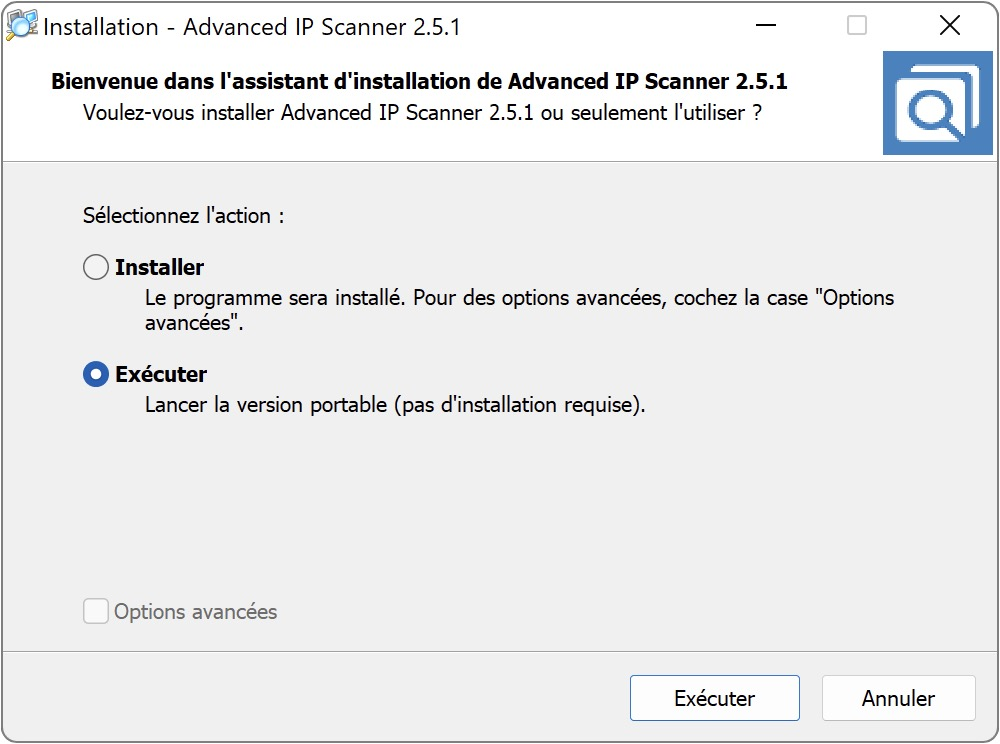
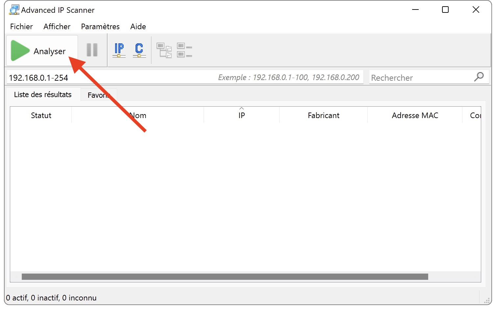
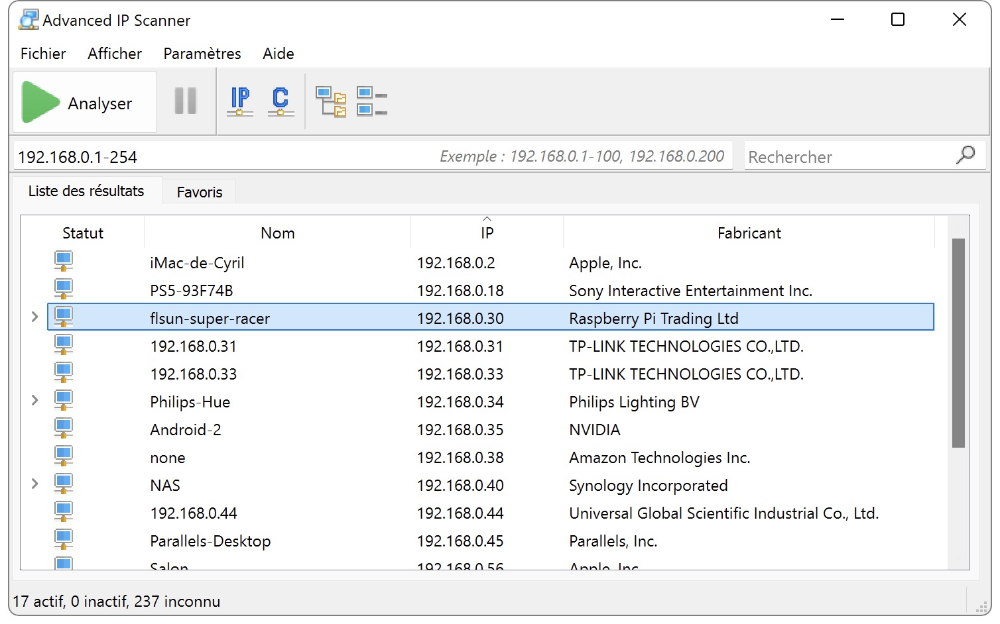

---
hide:
  - toc
---

# Connexion SSH sous Windows

- Afin d’obtenir l’adresse IP de votre Raspberry Pi sur votre réseau, téléchargez **Advanced IP Scanner** ici : <a href="https://www.advanced-ip-scanner.com/fr/" target="_blank">https://www.advanced-ip-scanner.com/fr/</a>

- Exécutez le fichier et sélectionnez Exécuter - Lancer la version portable :

{ width="600" }
 
- Une fois démarré cliquez sur Analyser :

{ width="600" }
 
- Récupérez ensuite l’adresse IP correspondante à votre Raspberry Pi (il porte le même nom que le nom d’hôte renseigné dans **Raspberry Pi Imager**) :

{ width="600" }

- Téléchargez et installez le logiciel **MobaXterm** ici : <a href="https://mobaxterm.mobatek.net/download-home-edition.html" target="_blank">https://mobaxterm.mobatek.net/download-home-edition.html</a>

- Lancez-le puis cliquez sur l'icône **Session** puis **SSH** :

 
- Renseignez l'adresse IP de votre Raspberry Pi dans le champ **Remote Host**, cochez la case **Specify username** et saisissez le nom d'utilisateur pi dans le champ puis cliquez sur **OK** :

 
- Sur la fenêtre qui s'affiche, saisissez votre mot de passe précédemment défini dans **Raspberry Pi Imager** (il ne s'affiche pas à la saisie, cela est normal) :
 
 
 
- Une fenêtre d'autorisation va s'afficher, autorisez-la. Il est également possible qu’une autre fenêtre vous demandant de changer le mot de passe s'affiche, ignorez-là.

- Une fois connecté, sur la partie gauche de la fenêtre vous avez l'accès aux dossiers et fichiers de votre Raspberry Pi et à la fenêtre d'invite de commande SSH sur la partie droite :
 
 

Vous pouvez ensuite continuer vers la section :material-arrow-right-box: [Installation des dépendances](../dependances.md) 
